# 🌊 Clean It Up! : Channel Blue

🕹️ **[Jogar agora no navegador](https://gd.games/kayozkx/clean-it-up)**

Jogo educacional 2D top-down desenvolvido no GDevelop 5

> Desenvolvido de Maio a Junho de 2026.

---

## 🎮 Sobre o Jogo

Channel Blue é um espírito das águas que percorre três ecossistemas aquáticos coletando lixo e enfrentando predadores corrompidos pela poluição. O objetivo é restaurar o equilíbrio ambiental dos ecossistemas, fase por fase.

**Gênero:** Ação / Educacional / Top-Down
**Plataforma:** PC (Windows) e Mobile (Android)
**Engine:** GDevelop 5
**Tempo de gameplay:** ~15 minutos (3 fases de 5 min)

---

## 📂 Estrutura do Repositório

```

channel-blue/
│
├── assets/
│   ├── cenas/
│   │
│   ├── eventos/
│   │   ├── fase1/
│   │   ├── fase2/
│   │   ├── fase3/
│   │   ├── fimdejogo1/
│   │   ├── fimdejogo2/
│   │   ├── fimdejogo3/
│   │   ├── intro/
│   │   ├── menu/
│   │   ├── transicao1/
│   │   ├── transicao2/
│   │   ├── transicao3/
│   │   └── vitoria/
│   │
│   └── objetos/
│
├── docs/
│
├── LICENSE
└── README.md

```
---

## 🕹️ Controles

### PC
| Tecla | Ação |
|-------|------|
| ↑ / w | Mover para cima |
| ← / A | Mover para esquerda |
| ↓ / S | Mover para baixo |
| → / D | Mover para direita |

### Mobile
O jogo conta com suporte a joystick virtual na tela, permitindo jogar diretamente pelo celular via navegador no [GD.games](https://gd.games/kayozkx/clean-it-up).


---

## 🎭 Personagens e Objetos

### 💧 Channel Blue — Protagonista

O espírito guardião das águas. Controlado pelo jogador, percorre os três ecossistemas coletando lixo e desviando de obstáculos e predadores. Possui 5 animações direcionais: parado, cima, baixo, direita e esquerda.


---

### 🗑️ Lixos

Itens coletáveis que descem pelo cenário. Cada fase possui tipos diferentes de resíduos representando os reais encontrados nos ecossistemas.

| Fase | Tipos de Lixo |
|------|--------------|
| Fase 1 — Lago | Garrafas PET, latas, sacolas plásticas, embalagens e garrafas de vidro |
| Fase 2 — Rio | Isopor, fraldas, canos PVC, sacolas, pneu e garrafas de vidro |
| Fase 3 — Mar | Tambores, embalagens, canudos, garrafas PET grande, garrafas de vidro |


---

### 🚧 Obstáculos

Elementos que causam dano ao jogador ao colidir. Nas Fases 2 e 3, obstáculos próximos (menos de 400px) passam a perseguir ativamente o jogador.

| Fase | Tipos de Obstáculo |
|------|-------------------|
| Fase 1 — Lago | Pedras, troncos flutuantes, cobras e piranhas |
| Fase 2 — Rio | Pedras de rio, troncos longos, redemoinhos, jacarés |
| Fase 3 — Mar | Minas navais, arraia, água-viva |


---

### 🐊 Jacaré — Predador Fase 1

Predador do lago. Persegue ativamente o jogador com velocidade de 120px/s. Sistema de imunidade de 3 segundos entre danos. Sprite espelha conforme a direção do jogador.
Tamanho maior: 75x50px


---

### 🐍 Cobra d'água — Predador Fase 2

Predador do rio. Mais veloz que o Jacaré, persegue com 140px/s. Mesmo sistema de imunidade e espelhamento. Representa o desequilíbrio ecológico causado pela poluição.Tamanho maior: 80x55px


---

### 🦈 Tubarão — Predador Fase 3

O predador mais perigoso do jogo. Persegue com 160px/s. Mesmo sistema de imunidade e espelhamento. Tamanho maior: 150x100px.

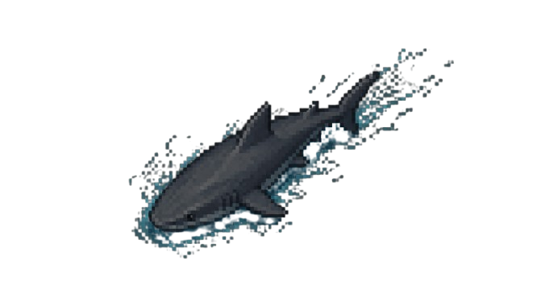

---

### 📊 Interface — HUD

Textos exibidos durante o gameplay em todas as fases:

| Elemento | Posição | Função |
|----------|---------|--------|
| Vidas | Canto superior esquerdo | Vidas restantes |
| Cronômetro | Centro superior | Tempo restante em segundos |
| Meta | Canto superior direito | Lixo coletado / Total necessário |

    


---

## 📊 Comparativo das 3 Fases

| Parâmetro | Fase 1 — Lago | Fase 2 — Rio | Fase 3 — Mar |
|-----------|--------------|-------------|-------------|
| Meta de Lixo | 15 itens | 25 itens | 35 itens |
| Vidas | 3 | 4 | 5 |
| Velocidade do Lixo | 80 px/s | 100 px/s | 120 px/s |
| Velocidade Obstáculo | 60 px/s | 110 px/s | 120 px/s |
| Spawn Lixo | 2 segundos | 1 segundo | 0.8 segundos |
| Spawn Obstáculo | 3 segundos | 2 segundos | 2 segundos |
| Correnteza | ❌ | ✅ 125px/s | ✅ 140px/s |
| Obstáculo Perseguidor | ❌ | ✅ | ✅ |
| Predador | Jacaré | Cobra d'água | Tubarão |
| Velocidade Predador | 120 px/s | 140 px/s | 160 px/s |
| Predador Persiste | ✅ | ✅ | ✅ |

---

## 🧩 Extensões Utilizadas

| Extensão | Função |
|----------|--------|
| TopDownMovementAnimator | Animações direcionais do personagem |
| TopDownCornerSliding | Deslizamento suave em cantos |
| BehaviorRemapper | Remapeamento de controles |
| SpriteMultitouchJoystick | Joystick virtual para jogar no celular |
| Gamepads | Suporte a controles externos |

---

---

# 📖 Parte 1 — O Início da Missão

---

## 🎬 Cena 1 — Intro

Primeira tela do jogo. Exibe uma sequência de slides animados apresentando os desenvolvedores e logos institucionais antes de ir automaticamente para o Menu Principal.


### Grupo: Transição da Apresentação para a Introdução e para o Menu

Dois slides temporizados são exibidos em sequência. O timer `TimeIntro` controla qual slide aparece. Após 7 segundos o jogo vai automaticamente para o Menu Principal.

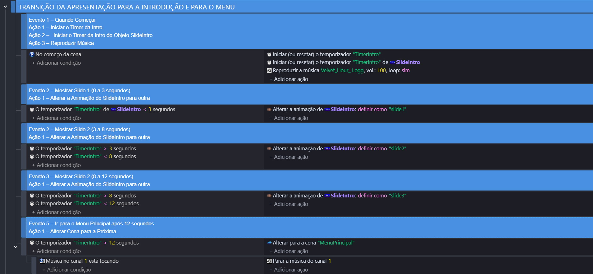

---

## 🏠 Cena 2 — Menu Principal

Tela inicial com música ambiente e botão Jogar. Um delay de 1 segundo (`DelayMenu`) evita que o clique acidental da cena anterior avance o jogo imediatamente.


### Grupo: Menu Principal

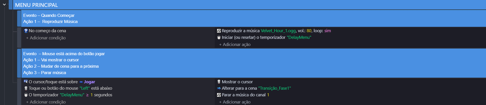

---

## 📜 Cena 3 — Transição Fase 1

Exibe 3 slides narrativos contando a história de Channel Blue e apresentando os controles antes de entrar na Fase 1. Cada slide é controlado por intervalos de tempo via `Timecontrole1`.


.png)


### Grupo: Transição Fase 1


---

## 🏞️ Cena 4 — Fase 1: Lago — Águas Esquecidas

O jogador inicia sua jornada em um lago amazônico poluído. Meta: coletar 15 lixos em 300 segundos com 3 vidas. Predador: Jacaré (120px/s). Sem correnteza.


### 🔵 Inicialização

Define todas as variáveis iniciais: pontos, vidas, lixo coletado, meta, fase encerrada, tempo restante. Inicia todos os timers e a música. Limita a posição do jogador dentro dos limites da tela.


---

### 🟡 Cronômetro

Calcula e exibe o tempo restante subtraindo o tempo decorrido de 300 segundos usando `TimerElapsedTime`.


---

### 🟢 Spawn

Cria lixo a cada 2 segundos e obstáculos a cada 3 segundos em posições aleatórias no topo da tela, com força descendente constante.


---

### ⚫ Limpeza de Tela

Remove lixo (Y≥723) e obstáculos (Y≥780) que saem pelos limites inferiores.


---

### 🔴 Colisões

Colisão com lixo: +1 na meta = +1 lixo coletado, efeito sonoro. Colisão com obstáculo: -1 vida, obstáculo deletado. Se vidas chegam a 0: Game Over.


---

### 🟠 Transição de Fase

Ao atingir a meta de 15 lixos: fundo muda para lago limpo, objetos são removidos, timer de transição inicia e após 3 segundos vai para a Fase 2. Se o tempo esgota: Game Over.


---

### 🟣 Predador — Jacaré

Persegue ativamente o jogador com força de 120px/s. Sistema de imunidade de 3 segundos entre danos. Sprite espelha conforme a direção do jogador.


---

## 💀 Cena 5 — Fim de Jogo 1

Exibida ao perder todas as vidas ou esgotar o tempo na Fase 1. Possui dois botões:
- **Reiniciar** → volta direto para a Fase 1
- **Menu** → volta para o Menu Principal


### Grupo: Fim de Jogo 1

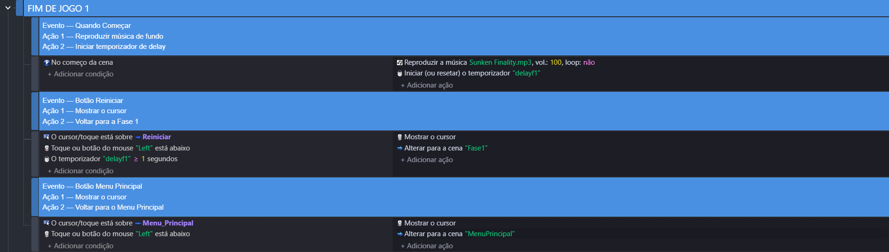

---

---

# 📖 Parte 2 — A Correnteza

---

## 📜 Cena 5 — Transição Fase 2

Exibe a tela de apresentação da Fase 2 com o nome "Rio: Correnteza Suja" antes de iniciar a fase. Timer de 3 segundos.


### Grupo: Transição para a Fase 2

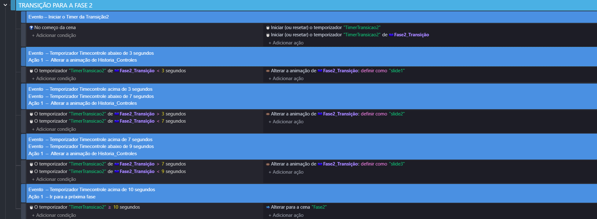

---

## 🌊 Cena 6 — Fase 2: Rio — Correnteza Suja

Dificuldade aumentada com lixo e obstáculos mais rápidos. Novidade: correnteza constante de 120px/s empurra o jogador para a direita. Meta: 25 lixos. Predador: Cobra d'água (140px/s).


### 🔵 Inicialização 2

Mesma estrutura da Fase 1 com valores diferentes: 4 vidas, meta 25, velocidades maiores. Adiciona timer de correnteza e spawn da cobra.

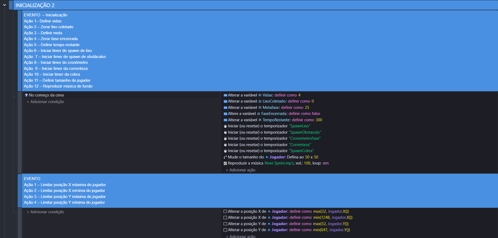

---

### 🟡 Cronômetro 2

Mesmo sistema da Fase 1 — exibe tempo restante em segundos.

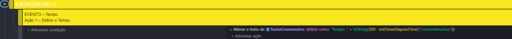

---

### 🟢 Spawn 2

Lixo criado a cada 1 segundo com velocidade de 100px/s. Obstáculos a cada 2 segundos. Correnteza aplica força constante de 125px/s no ângulo 0° (direita) sobre o jogador.

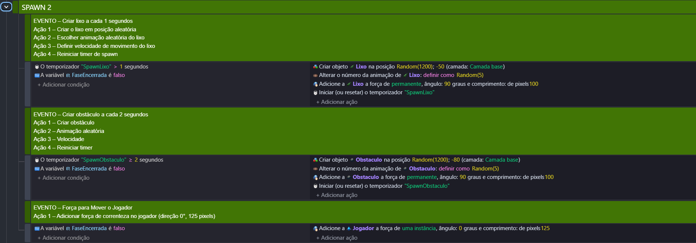

---

### ⚫ Limpeza de Tela 2

Remove lixo (Y≥723) e obstáculos (Y≥780).

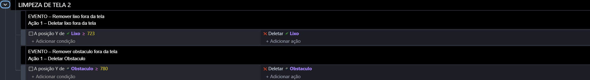

---

### 🔴 Colisões 2

Mesma lógica da Fase 1. Meta atualizada para "/25". Obstáculos a menos de 400px do jogador passam a persegui-lo.

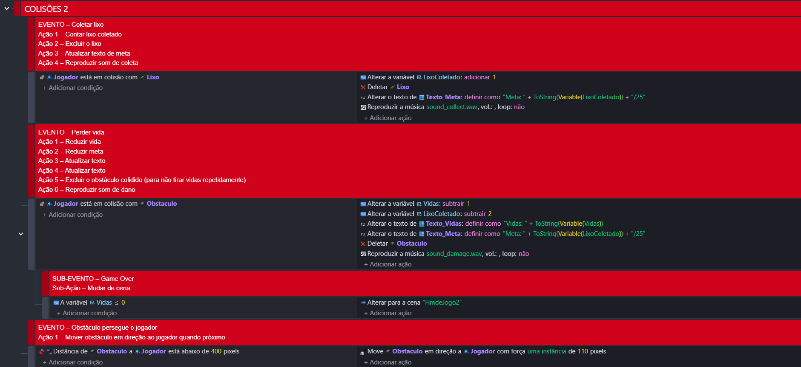

---

### 🟠 Transição de Fase 2

Ao atingir 25 lixos: fundo muda para rio limpo, cobra e objetos deletados, vai para Transição Fase 3 após 3 segundos.

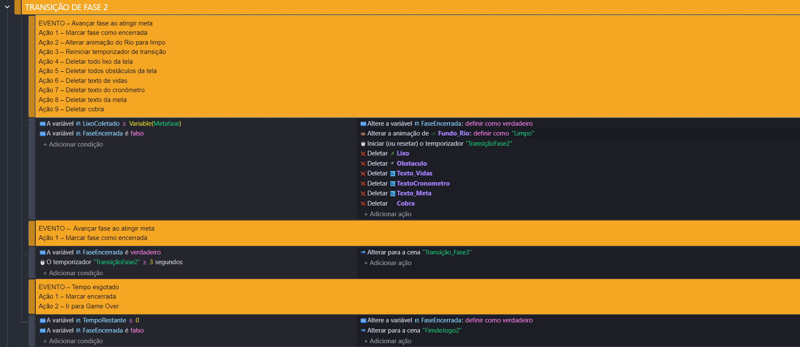

---

### 🟣 Predador — Cobra d'água

Persegue com 140px/s — mais rápida que o Jacaré. Mesmo sistema de imunidade e espelhamento de sprite.

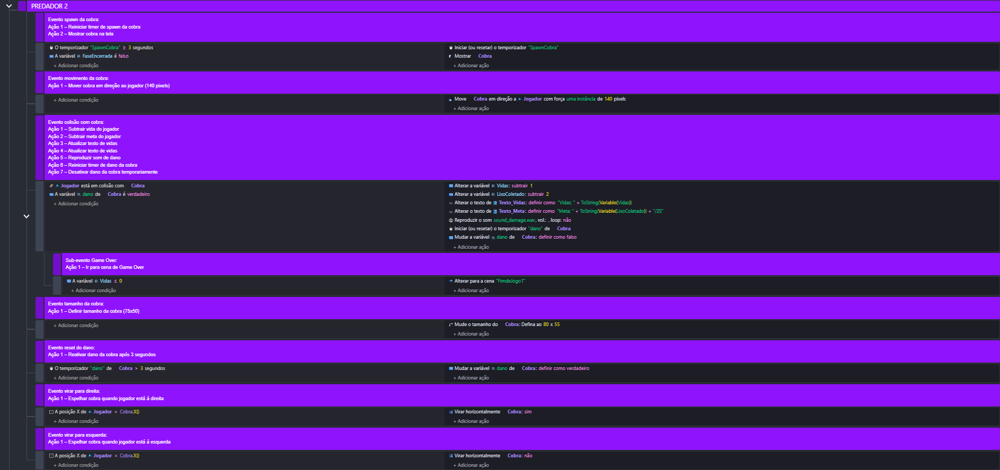

---

## 💀 Cena 9 — Fim de Jogo 2

Exibida ao perder todas as vidas ou esgotar o tempo na Fase 2. Possui dois botões:
- **Reiniciar** → volta direto para a Fase 2
- **Menu** → volta para o Menu Principal


### Grupo: Fim de Jogo 2

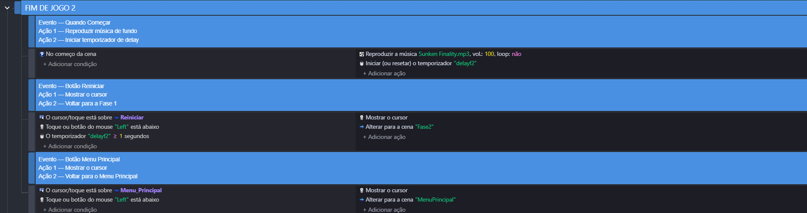

---

---

# 📖 Parte 3 — O Abismo

---

## 📜 Cena 7 — Transição Fase 3

Exibe a tela de apresentação da Fase 3 com o nome "Mar: Abismo de Plástico". Timer de 3 segundos.


### Grupo: Transição Final


---

## 🌐 Cena 8 — Fase 3: Mar — Abismo de Plástico

A fase mais difícil. Lixo e obstáculos na velocidade máxima (120px/s), correnteza marítima, obstáculos perseguidores e o Tubarão que persiste na tela. Meta: 35 lixos.


### 🔵 Inicialização 3

Meta de 35 lixos, música épica. Adiciona timer do tubarão. Estrutura idêntica às fases anteriores com valores máximos.

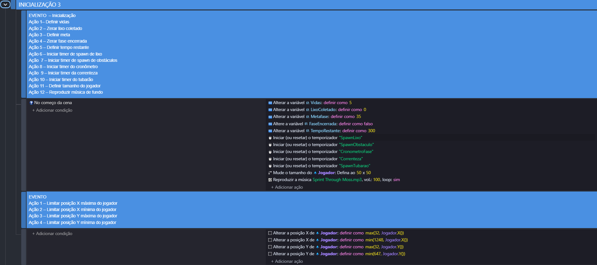

---

### 🟡 Cronômetro 3

Mesmo sistema das fases anteriores.

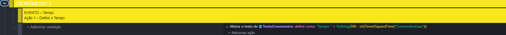

---

### 🟢 Spawn 3

Lixo a cada 0.8 segundos com 100px/s. Obstáculos a cada 2 segundos com 100px/s. Correnteza 140px/s. Todos os obstáculos a menos de 400px perseguem o jogador.

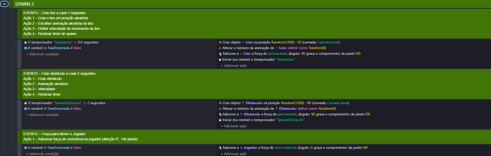

---

### ⚫ Limpeza de Tela 3

Remove lixo (Y≥723) e obstáculos (Y≥780).

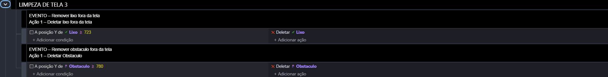

---

### 🔴 Colisões 3

Mesma lógica. Meta atualizada para "/35".

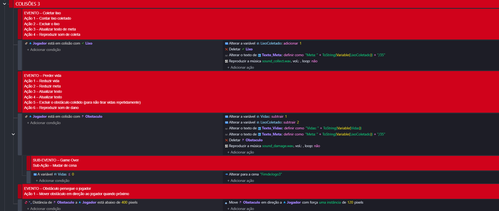

---

### 🟠 Transição de Fase 3

Ao atingir 35 lixos: fundo muda para oceano limpo e após 3 segundos vai para a tela de Vitória.

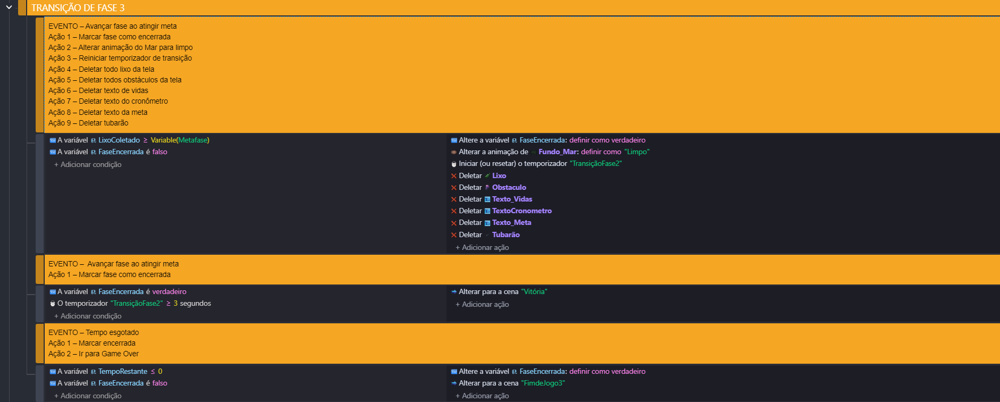

---

### 🟣 Predador — Tubarão

O predador mais perigoso. 160px/s, persiste na tela como ameaça constante. Tamanho 150x100px. Mesmo sistema de imunidade e espelhamento.

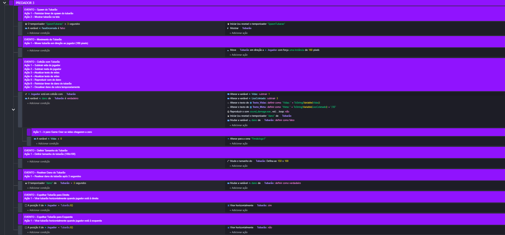

---

---

## 💀 Cena 12 — Fim de Jogo 3

Exibida ao perder todas as vidas ou esgotar o tempo na Fase 3. Possui dois botões:
- **Reiniciar** → volta direto para a Fase 3
- **Menu** → volta para o Menu Principal


### Grupo: Fim de Jogo 3


---

## 🏆 Vitória

Tela final exibida ao completar as 3 fases. Dois slides comemorativos temporizados com música de triunfo. Após 11 segundos exibe a tela final com logo e botão para voltar ao Menu.


### Grupo: Vitória


---

---

## 📂 Documentação Completa

A documentação completa estará na pasta `docs/` em breve

---

## 🛠️ Tecnologias

- GDevelop 5 (JavaScript)
- Suno.ai — músicas
- Leonardo.ai — sprites
- Ideogram.ai — cenários
- Canva Magic Media — interfaces
- Freesound.org — efeitos sonoros

---

## 👤 Autor

Desenvolvido por **Kayozkx**

---

> Projeto com foco em educação ambiental e preservação dos ecossistemas aquáticos brasileiros.
